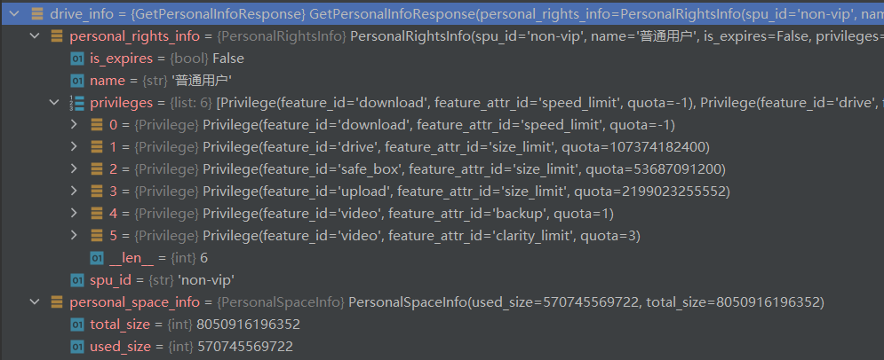

# aligo
🚀🔥使用Python连接阿里云盘 👍👍👍 实现了官方大部分功能


 

> 为了完善代码提示, 方便大家代码书写, **aligo** 引入了一些 **python 3.8** 的新特性, 所以要求 **python >= 3.8.***

```bash
pip install aligo
```

或

```bash
pip install aligo -i https://pypi.org/simple
```

必要时可以加个 `--upgrade` 参数


## 快速入门

```python
from aligo import Aligo

ali = Aligo()

user = ali.get_user()

BaseUser(user_name='155***151', user_id='3e935da769594ca4849c7c1409efb96f', default_drive_id='1066884')

# 获取网盘根目录文件列表
ll = ali.get_file_list()

```

- 阿里云盘和百度不同, 百度网盘使用的是 **路径** 方式定位文件, 而阿里云盘使用的是 **drive_id** / **share_id** + **file_id** 定位文件
- 在 **aligo** 中, 所有默认 **drive_id** 都可省略, 所以一般只需提供 **file_id** 参数即可


## 基本功能

1. 登录
   - [x] 扫描二维码登录
   
     ```python
     # 导包, 这里为了方便演示, 导入全部
     from aligo import *
     
     # 创建身份认证对象
     # 所有参数可选, 默认二维码扫码登录, 推荐
     auth = Auth()
     
     # 如需自定义二维码显示方式, 可指定一个函数, 详情参考源码
     # auth = Auth(show=show_qrcode)
     ```
   
   - [x] **refresh_token** 登录
   
     ```python
     # 也可使用 refresh_token 验证登录
     auth = Auth(refresh_token='<refresh_token>')
     
     # refresh_token 参数可在 Chrome -> F12 -> Application -> Local Storage -> token 中寻找
     ```
   
   - [x] 持久化登录
   
     ```python
     # aligo 支持自动自动刷新 access_token
     # 所以不是每次使用都需要登录的
     # aligo 会将 token 信息保存到 <home>/.aligo 目录下的配置文件中
     # 配置文件名为 <name>.json, name 通过一下方式提供, 默认为 'aligo'
     
     auth = Auth(name='aligo')
     ```
   
2. 获取信息
   - [x] 获取用户信息

     ```python
     # 创建 Auth 对象之后, 再创建 Aligo 对象, 剩下的就是方法调用了
     # 需要提供一个 Auth 对象, 可选, 默认 Auth()
     ali = Aligo()
     user = ali.get_user()
     
     # user 是一个 BaseUser 对象, 详情参考源码, 非常简单😁
     ```

   - [x] 获取网盘信息

     ```python
     # 比如获取 云盘容量 信息
     drive_info = ali.get_personal_info()
     ```

     

3. 功能太多, 就不一一列举, 大致如下

   - 获取文件列表
   - 上传/下载/秒传
   - 复制/移动/重命名
   - 收藏/分享/搜索
   - 回收站相关
   - 批量 xxx
   - 自定义分享

   一般说来, 能用官方客户端实现的基本操作, 你都可以用 **aligo** 试试. 无常用功能? [反馈](https://github.com/foyoux/aligo/issues/new)


## 用法示例

TODO


## 自定义功能

这里以删除文件为例, 自定义功能

> 其他例子我想不出来了, 因为基本上都实现了

```python
from aligo import Aligo

class CustomAligo(Aligo):
    """自定义 aligo """
    
    # devtools ...
    V2_FILE_DELETE = '/v2/file/delete'
    
	def delete_file(self, file_id:str):
		"""删除文件"""
        self._post(V2_FILE_DELETE, body={'file_id':file_id})
        
cali = CustomAligo()

cali.delete_file('<file_id>')        
```


## FAQ

1. 为什么代码中注释这么少(没有)

   因为模块太多了, 同时也是没必要的, apis接口简单, 稍许使用, 便可完全掌握, 所以我也就偷个懒了. 

   如果有问题可以随时 [反馈](https://github.com/foyoux/aligo/issues/new)

   

2. 有(彻底)删除文件(夹)的功能吗?

   没有, 因为太过危险, 但是有移动文件(夹)到回收站的功能. 如果万一要实现的话, 请参考自定义功能

   

3. 可以操作保险箱中的文件吗?

   不可以, 非必要, 也不安全

   

4. 为什么获取文件列表(10000个)这么慢?

   这是没办法的事情, 官方限制最多一次性获取 **200** 个, 10000 个的话, 要发几十个请求, 并且还不能并发或者批量, 因为后一个请求依赖前一个请求的内容.

   

5. 没有你想要的功能?

   请尽管 [反馈](https://github.com/foyoux/aligo/issues/new), 如果提议不错, 我会好好考虑的. 如果不能附加进去, 我也会回复, 给一些建议或替代方案.

   

6. 你这文档也太简单了吧?

   是很简单, 后续看是否受欢迎(Star多不多), 慢慢完善. 这个花了我不心思, 也拖了好久, 今天赶鸭子上架. 🦆🦆🦆

   

7. **BUG在所难免**

   如果 **出现BUG** 或 **使用问题**, 或 **不合逻辑的设计**, 或者 **建议**, 请 [issue](https://github.com/foyoux/aligo/issues/new)

   
